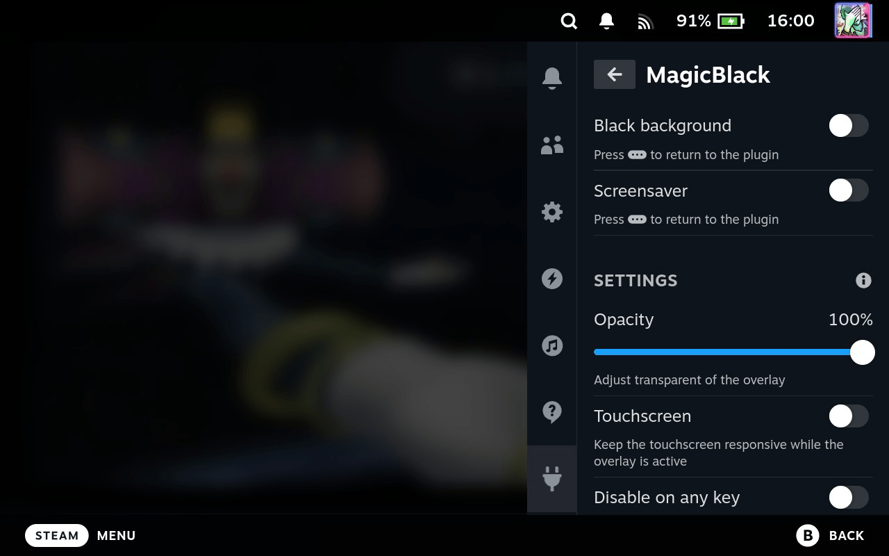

# MagicBlack

A magic plugin for the Decky Loader that overlays the screen with black color, emulating the screen being turned off on the Steam Deck OLED.

## 💾 Installation

### Using the Decky store

1. Install [Decky Loader](https://github.com/SteamDeckHomebrew/decky-loader/tree/main?tab=readme-ov-file#-installation)
2. Switch to steam game mode
3. Press 
4. Go to the tab 
5. In the upper right corner, click 
6. Find MagicBlack in the plugin list or search for it
7. Press the Install button

## 🚀 Getting started

Now that you have MagicBlack, press  to overlay a black background over the entire screen.